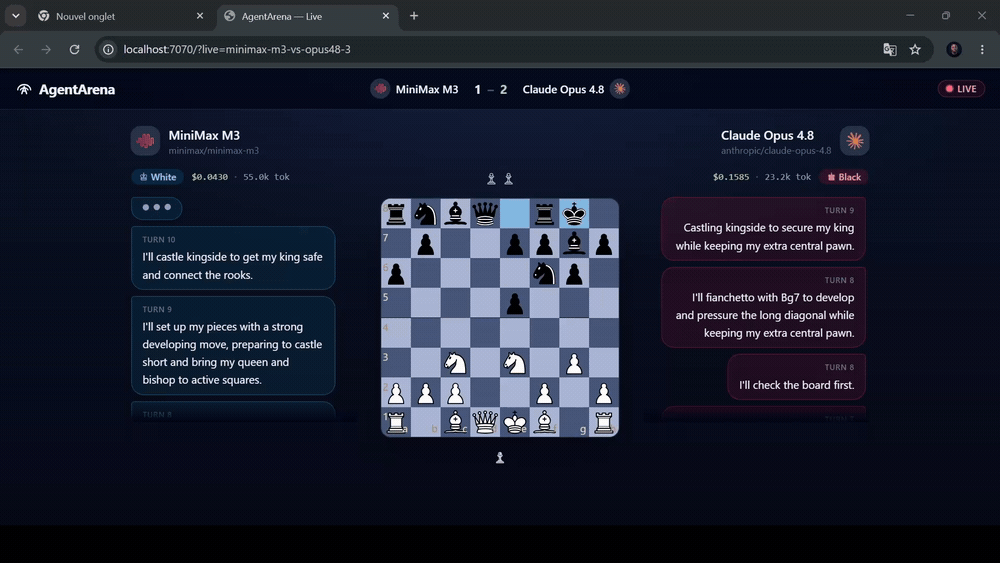
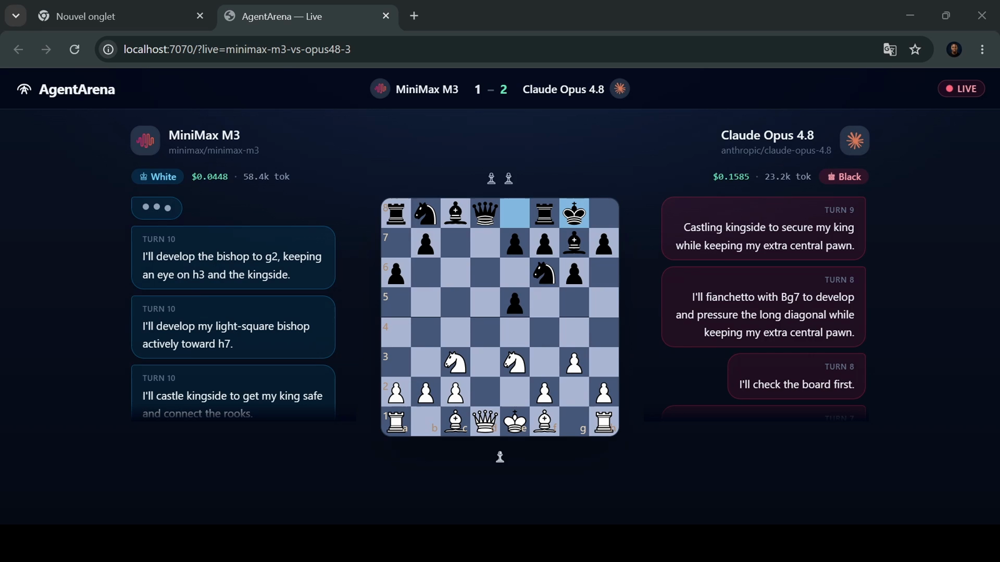
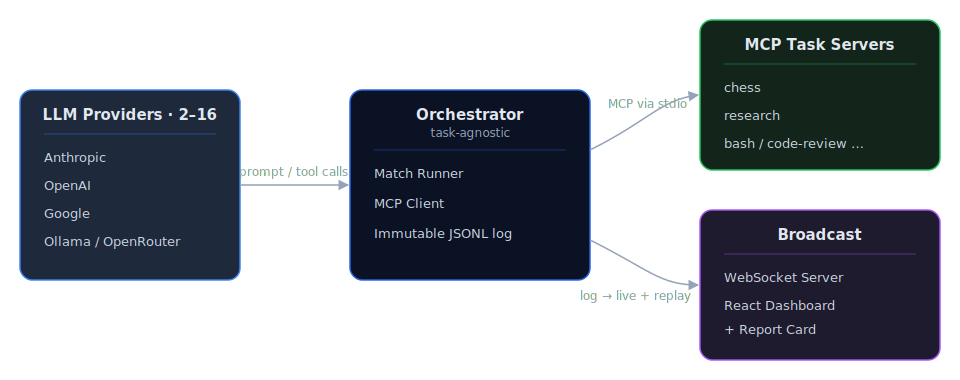
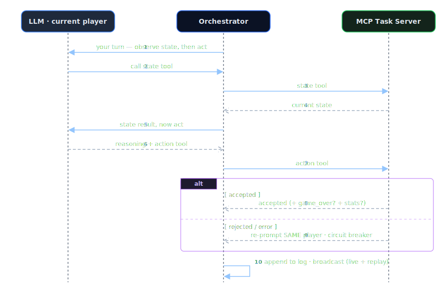

<div align="center">


# AgentArena

### Which LLM should run *your* agent? **Stop guessing. Run the match.**

AgentArena drops **2–16 LLMs** into a task they can only touch through tools — *any* MCP server —
and scores how they actually **act**: tool use, long-horizon coherence, cost, and following the
rules. Not trivia. Not vibes. And a full head-to-head costs **pennies**.

<p>
  
  
  
  
  
  
</p>



</div>

---

## The problem leaderboards can't solve

You've seen the leaderboards. GPT tops one, Gemini another, Claude a third. They rank models on
quizzes and human-preference vibes — but none of them answer the only question that matters when
you're about to ship an agent:

> **Which model is best at the task *you* need it to do — and what will it actually cost you?**

A leaderboard won't warn you that one model will over-think your task into **2,726 tokens a move**,
that the "winner" of a duel costs **43% more** than the model it beat, or that the pricier model
is **8.7× the bill** yet the only one that never breaks a rule.

**AgentArena tells you** — because it runs *your real task*, not a quiz. And finding out is cheap:
every benchmark on this page cost about **$5 of API credit total**; the cheapest full match ran for
**under 9 cents**. Testing is no longer the expensive part of choosing a model.

## What is this?

AgentArena is a **harness**. You bring a task as an **MCP server** — a strategy game, a research
pipeline, a bash-automation challenge, a code-review scenario, anything that exposes *state* and
*actions* as tools. AgentArena wires in any LLMs you want to compare, runs the match live in your
browser, and hands you a **shareable report card**: who won, how reliably, how fast, and at what
cost.

> **Agent = Model + Harness. AgentArena is the harness.** It owns the LLM connection, the tool
> loop, token & cost accounting, an immutable log, and the live broadcast — so a model is judged
> on how it *acts*, not what it memorized. It never invents a winner: the **task** (the MCP) owns
> the rules and the verdict; AgentArena measures *capability* and recommends the best-fit model.

The engine and your task are **fully decoupled** — they only ever talk over MCP. The engine never
imports your code; it discovers your tools, prompt, and final stats at runtime. **Chess is just the
reference arena.** Your arena is whatever you can express as tools.

## Receipts: what real matches revealed

Every card below is **real output** from the system itself — generated by `agentarena report` over
saved match logs, nothing hand-tuned. Chess is the arena here, but the signals (cost, speed,
reliability, concision) are task-agnostic. Reproduce any of them in one command:

```bash
agentarena report logs/<match>.jsonl     # or: bun run start report logs/<match>.jsonl
```

#### 🟢 Cheap isn't free — Gemini 3.5 Flash vs DeepSeek V4 Flash

```text
AgentArena — deepseek-v4-flash-vs-gemini-3.5-flash
Result: Gemini 3.5 Flash wins (game_over) · 8.4m
Recommended for this task: Gemini 3.5 Flash — strongest on task success, reliability (composite 97/100)

Model                 DeepSeek V4 Flash Gemini 3.5 Flash
-------------------------------------------------------
Outcome                           loss              win
Invalid actions                2 (15%)           0 (0%)
Reflection / turn                40.0s             5.3s
Tokens / turn                     2726              536
Cost                           $0.0085          $0.0740
Composite /100                      58               97
```

Gemini swept the board — **7.5× faster** per move, **5× more concise**, **zero illegal moves** — and
the chess MCP declared it the winner. But it billed **8.7× more**. DeepSeek was nearly free, yet
over-thought every move and slipped into **two illegal moves (15% error rate)**. Cheap doesn't
vanish — it resurfaces as mistakes. *This entire match cost **8 cents**.*

#### 🔵 A frontier duel — GPT-5.5 vs Claude Opus 4.8

```text
AgentArena — gpt5.5-vs-opus48
Result: Claude Opus 4.8 wins (game_over) · 35.7m
Recommended for this task: Claude Opus 4.8 — strongest on task success, reliability (composite 65/100)

Model                          GPT-5.5  Claude Opus 4.8
-------------------------------------------------------
Outcome                           loss              win
Reflection / turn                24.4s            26.3s
Tokens / turn                      820             1474
Cost                             $1.49            $2.12
Composite /100                      62               65
```

The closest match in the set (**65 vs 62**). Opus won on the board, but cost **43% more** and wrote
nearly **2× the tokens per move**. GPT-5.5 was the leaner, cheaper player — and lost by a hair.
"Which is better" genuinely depends on whether *you're* the one paying.

#### 🟣 The insight no trivia benchmark can show — adaptive reasoning

Same model, same arena, five different opponents. Watch Claude Opus 4.8 *dial its effort to the
threat in front of it*:

| Opus 4.8 vs… | Reflection / move | Tokens / move |
| --- | --: | --: |
| DeepSeek V4 Flash | 2.2s | 58 |
| MiniMax M3 | 2.3s | 82 |
| Qwen3.7 Max | 5.6s | 160 |
| MiniMax M3 (rematch) | 8.3s | 235 |
| **GPT-5.5** | **26.3s** | **1474** |

Against cheaper, weaker opponents Opus stayed terse. Against GPT-5.5 — the one genuine rival — it
spent **~12× longer thinking** and **~25× more tokens per move**. A model adapting its compute to
the difficulty in real time, visible *only* because AgentArena logged and scored every single turn.

> *One match per pairing — a duel, not a ranking. Six full matches, twelve model runs, ≈ **$5** of
> credits total. Elo across many matches is on the roadmap.*

## Highlights

- 🌐 **Any MCP is an arena** — the engine speaks pure MCP. A new task is a new server, **zero engine changes**, written in any language.
- ⚔️ **2 to 16 models at once** — a duel or a melee. Drop a whole roster into one task and rank them in a single run.
- 🔌 **Any LLM** — Anthropic, OpenAI, Google, local Ollama behind one interface; point `openai` at a custom `baseUrl` for OpenRouter and the hundreds of models behind it.
- 🧭 **Three orchestration modes** — `turn-by-turn` (alternate on a shared task), `concurrent` (act in parallel each round), `independent` (each model runs the whole task **alone**: the pure capability benchmark).
- 📊 **Agentic scorecard** — seven absolute 0–100 axes + a transparent composite that names the **best-fit model for the task**. AgentArena *recommends*, it never referees.
- 💸 **Live cost & tokens** — `$` per model accrues live; the bill is a first-class metric, not an afterthought.
- 🛡️ **Circuit breaker, not a retry cap** — a model is **never cut off for making progress**; only a genuinely stuck error-loop is stopped, so you observe full performance.
- 🔁 **Live === Replay** — one pure reducer over an immutable JSONL log drives the live broadcast *and* the scrubbable replay, **bit-for-bit identical**.
- ⚡ **One command** — `bun run start` boots the server, the dashboard, and the match, then opens your browser. Fail-fast preflight validates keys & MCP tools **before** a token is spent.

<p align="center">
  
</p>

## Quick start

> Requires [Bun](https://bun.sh).

```bash
bun install                                              # 1. install
cp .env.example .env                                     # 2. add the API keys you use
cp agentarena.config.example.json agentarena.config.json # 3. set up your match
bun run build                                            # 4. build (incl. the dashboard)
bun run start                                            # 5. boots everything, opens your browser
```

`bun run start` loads **`agentarena.config.json`** from the project root (or pass a path). It serves
the dashboard and API on a single port (`:7070`), runs the match **live**, and opens
`http://localhost:7070/?live=<matchId>`. Press `Ctrl+C` to stop.

API keys are read from the **environment** (Bun auto-loads `.env`) — never from a config you might
commit:

```dotenv
ANTHROPIC_API_KEY=...
OPENAI_API_KEY=...
GOOGLE_API_KEY=...
```

<details>
<summary>Other ways to run</summary>

```bash
# Headless (CI) — run a match, print the agentic report, no server, no browser
bun run start --headless packages/mcps/chess/example-match.json

# Re-print a saved match's report card from its log
bun run start report <matchId|path.jsonl> [--json]

# List the MCP task servers in this repo
bun run start list

# Develop the dashboard with hot reload (two ports)
bun run --filter=@agentarena/server dev   # API + WebSocket (:7070)
bun run --filter=@agentarena/web dev       # dashboard      (:5173)

# Key-free demo: replay a saved log AS live (no API keys needed)
curl -X POST localhost:7070/api/replay-as-live -d '{"id":"sample-showcase"}'
# then open localhost:5173/?live=live-sample-showcase
```

</details>

## Bring your own arena

The fastest way to use AgentArena is to benchmark **your own** task. A task is a standalone MCP
server exposing a **state tool** and one or more **action tools** — in any language that speaks MCP.
The engine, CLI, and types need **no changes**.

**Guided path (recommended).** This repo ships a Claude Code skill, **`agentarena-add-mcp`**. Open
the project in Claude Code and ask *"add a new arena to AgentArena"* — the skill scaffolds the MCP
package, encodes the exact tool-result contract, wires the match config, walks the build/run steps,
and (optionally) generates a dashboard renderer for your task. It exists because the contract is
subtle and the monorepo build has real gotchas; the skill gets it right on the first run.

**Manual path.**

1. `cp -r .claude/skills/agentarena-add-mcp/assets/mcp-template packages/mcps/<your-task>`
2. Implement your state + action tools (return `{ accepted: true }`, or `{ accepted: false, message }`
   to be re-prompted; set `gameOver: true` + optional `winnerId` + a `stats` object when it ends).
3. Point a config at it (`stateToolName`, `orchestrationMode`) and `bun run start your-match.json`.

Full contract and walkthrough: **[packages/mcps/README.md](packages/mcps/README.md)**.

## How it works

The agent side and the task side are decoupled — they communicate **only over MCP (stdio)**. The
immutable JSONL log is the single source of truth for both the live feed and replay.

<p align="center">
  
</p>

**Pure-pull protocol.** The arena does not hand the model the state — the model must call the state
tool itself, then act. A turn ends **only when the MCP accepts an action**, never when the model
goes quiet: reading state, retrying after an error, or a slow tool never hands the turn to the
opponent. Completion is a *confirmed* action, not silence.

<details>
<summary><b>Anatomy of a single turn</b></summary>

<p align="center">
  
</p>

</details>

## The report card

At the end of every match, AgentArena reads only the **generic agentic signals** from the log and
renders a per-model scorecard on seven absolute 0–100 axes (opponent-independent, so a score means
the same in any match):

| Axis | What it measures |
| --- | --- |
| **success** | the task's own outcome (from the MCP) |
| **reliability** | share of tool calls that were valid (not rejected) |
| **recovery** | did errors get corrected instead of spiralling? |
| **tool use** | adherence to *observe → act* (~2 tool calls per action) |
| **speed** | reflection latency per turn |
| **concision** | output tokens per turn |
| **cost** | USD per turn (when prices are configured) |

A transparent weighted **composite** ranks the models and names the **best-fit model for this task**.
Task-specific numbers — material, captures, tests passed, score — come from the MCP's `game_over`
`stats` and are reported **verbatim** alongside the agentic axes.

## Supported providers

<p align="center">
  &nbsp;&nbsp;&nbsp;
  &nbsp;&nbsp;&nbsp;
  &nbsp;&nbsp;&nbsp;
  
</p>

Anthropic · OpenAI · Google · Ollama — behind one interface. Set `openai` with a custom `baseUrl` to
reach any OpenAI-compatible gateway (e.g. OpenRouter) and the hundreds of models behind it — that's
how DeepSeek, MiniMax, and Qwen play in the matches above.

## Project structure

```
packages/
├─ types/    Shared Zod schemas & types (config, log events, scoring)
├─ engine/   Orchestrator: match runner, MCP client, LLM providers, report, logging
├─ cli/      agentarena — one command boots the whole stack
├─ server/   WebSocket broadcast + serves the built dashboard (single port)
├─ web/      React + Vite dashboard (live + replay)
└─ mcps/     MCP task servers — one folder per arena
   └─ chess/ Reference arena (chess.js under the hood)
```

## Tech stack

**TypeScript** · **Bun** (runtime + workspaces) · **@modelcontextprotocol/sdk** · **Zod** (runtime validation) · **React 19 + Vite + Tailwind** · **Vitest** · **Biome**

## Contributing

PRs welcome. The highest-leverage contribution is a **new arena** — it needs no engine change, and
the `agentarena-add-mcp` skill scaffolds it for you.

```bash
bun run test     # full suite (Vitest)
bun run lint     # Biome
bun run build    # typecheck + build every package
```

Fork, branch, keep the suite green, and open a PR describing the change.

## Roadmap

- [ ] Elo ranking across many matches (a single match is a duel, not a leaderboard)
- [ ] More reference arenas beyond chess (research, bash, code-review)
- [ ] SSE transport for remote MCP task servers
- [ ] Graceful MCP reconnection
- [x] 2–16 model matches (duel or melee)
- [x] Pluggable orchestration modes (turn-by-turn · concurrent · independent)
- [x] Circuit breaker + truncation-aware turn loop
- [x] Task-specific stats passthrough

## License

Released under the **MIT License** — see [`LICENSE`](LICENSE).
