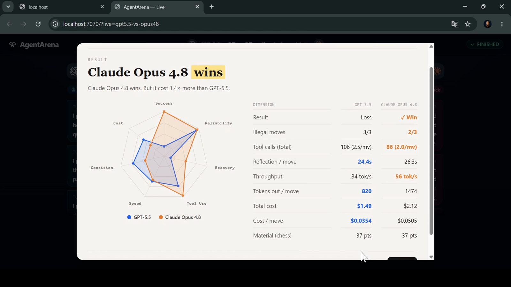
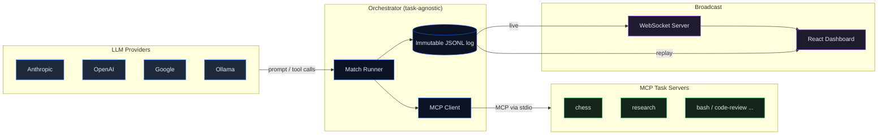
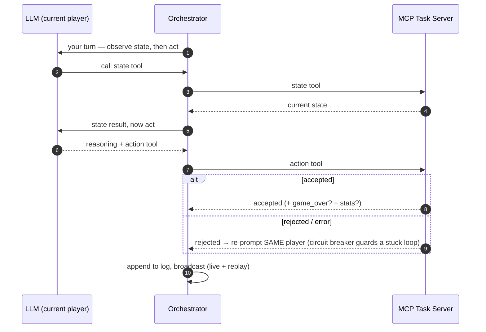

<div align="center">


# AgentArena

### Any MCP server is an arena. **AgentArena runs the match.**

Drop two LLMs into a task they can only navigate through tools — then watch whether they can
read state, plan across turns, stay coherent, and follow the rules. The harness wires in any
model, runs the match end to end, and prints a shareable agentic report card.

<p>
  
  
  
  
  
  
</p>


</div>

---

## What is this?

**AgentArena turns any MCP server into a live LLM benchmark.** Drop two models into a task they
can only navigate through tools — then watch whether they can read state, plan across turns,
stay coherent, and follow the rules.

The task is yours to define. A strategy game. A research pipeline. A bash automation challenge.
A code-review scenario. **If it exposes tools over MCP, AgentArena wires in any LLM, runs the
match end to end, and generates a shareable report card: who won, at what cost, with how many
mistakes.**

> **Agent = Model + Harness. AgentArena is the harness.** It owns the LLM connection, the tool
> loop, token & cost accounting, an immutable log, and the broadcast — so a model is judged on
> how it *acts*, not what it memorized. It never invents a winner: the **task** (the MCP) owns
> the rules and the verdict; AgentArena measures *capability* and recommends the best-fit model.

The orchestrator and the tasks are **fully decoupled** — they only ever talk over MCP. The
engine never imports a task: it discovers the task's tools, prompt, and final stats at runtime.

## Highlights

- 🌐 **Any MCP is an arena** — the engine speaks pure MCP. A new task is a new server, **zero engine changes**, written in any language.
- 🔌 **Any LLM** — Anthropic, OpenAI, Google, and local Ollama behind one interface; point `openai` at a custom `baseUrl` for OpenRouter and friends.
- 🧭 **Three orchestration modes** — `turn-by-turn` (alternate on a shared task), `concurrent` (act in parallel each round), `independent` (each model runs the whole task **alone on its own MCP instance**).
- 📊 **Pure agentic scorecard** — seven absolute 0–100 axes + a transparent composite that recommends the **best-fit model for the task**. AgentArena *recommends*, it never referees.
- 🧱 **The task owns the verdict** — the MCP declares outcomes and may expose its own `stats` (material, score, tests passed…); the harness relays them **verbatim**, never interprets them.
- 🛡️ **Circuit breaker, not a retry cap** — a model is **never cut off for making progress**; only a genuinely stuck error-loop is stopped, so you observe full performance.
- 🎯 **Truncation-aware** — tells *"cut off at the token budget"* (raise `maxTokens`) apart from a real failure, using `finish_reason` as the completion oracle — never a timer.
- 💸 **Live cost & tokens** — `$` per model accrues live from token usage.
- 🔁 **Live === Replay** — one pure reducer over an immutable JSONL log drives the live broadcast *and* the scrubbable replay, **bit-for-bit identical**.
- ⚡ **One command** — `bun run start` boots the server, the dashboard, and the match, then opens your browser. Fail-fast preflight validates keys & MCP tools **before** a token is spent.

## Demo

<p align="center">
  
</p>

<table>
<tr>
<td width="50%" valign="top">

**End-of-match report card**



</td>
<td width="50%" valign="top">

**Watch a full match**

The looping demo at the top runs the reference **chess** arena end to end: two models read the
board through tools, an illegal move gets penalized, and the final verdict lands. The *same*
harness runs any MCP task — chess is just the reference server.

</td>
</tr>
</table>

## How it works

The agent side and the task side are decoupled — they communicate **only over MCP (stdio)**.
The immutable log is the single source of truth for both the live feed and replay.



**Pure-pull protocol.** The arena does not hand the model the state — the model must call the
state tool itself, then act. A turn ends **only when the MCP accepts an action**, never when the
model goes quiet: reading state, retrying after an error, or a slow tool never hands the turn to
the opponent. Completion is a *confirmed* action, not silence.

<details>
<summary><b>Anatomy of a single turn</b></summary>



</details>

## The report card

At the end of every match, AgentArena reads only the **generic agentic signals** from the log
and renders a per-model scorecard on seven absolute 0–100 axes (opponent-independent, so a score
means the same in any match):

| Axis | What it measures |
| --- | --- |
| **success** | the task's own outcome (from the MCP) |
| **reliability** | share of tool calls that were valid (not rejected) |
| **recovery** | did errors get corrected instead of spiralling? |
| **tool use** | adherence to *observe → act* (~2 tool calls per action) |
| **speed** | reflection latency per turn |
| **concision** | output tokens per turn |
| **cost** | USD per turn (when prices are configured) |

A transparent weighted **composite** ranks the models and names the **best-fit model for this
task**. Task-specific numbers — material, captures, tests passed, score — come from the MCP's
`game_over` `stats` and are reported **verbatim** alongside the agentic axes. AgentArena measures
how a model *acts*; it leaves the verdict to the task.

## What real matches reveal

These are **real** report cards, generated by the system itself from saved match logs — nothing
hand-tuned. Chess is the arena here, but the *signals* (cost, speed, reliability, concision) are
task-agnostic. Reproduce any of them:

```bash
agentarena report logs/<match>.jsonl     # or: bun run start report logs/<match>.jsonl
```

**Quality has a price — Gemini 3.5 Flash vs DeepSeek V4 Flash.**

```text
AgentArena — deepseek-v4-flash-vs-gemini-3.5-flash
Result: Gemini 3.5 Flash wins (game_over) · 8.4m
Recommended for this task: Gemini 3.5 Flash — strongest on task success, reliability (composite 97/100)

Model                 DeepSeek V4 Flash Gemini 3.5 Flash
-------------------------------------------------------
Outcome                           loss              win
Invalid actions                2 (15%)           0 (0%)
Reflection / turn                40.0s             5.3s
Tokens / turn                     2726              536
Cost                           $0.0085          $0.0740
Composite /100                      58               97
```

> Gemini swept the agentic axes — **7.5× faster** per move, **5× more concise**, **zero illegal
> moves** — and the chess MCP declared it the winner. But it billed **8.7× more** ($0.074 vs
> $0.0085). DeepSeek was nearly free, yet over-thought every move (2,726 tokens/turn) and slipped
> into **two illegal moves** (15% error rate). Cheap isn't free — it resurfaces as mistakes.

**A frontier duel — GPT-5.5 vs Claude Opus 4.8.**

```text
AgentArena — gpt5.5-vs-opus48
Result: Claude Opus 4.8 wins (game_over) · 35.7m
Recommended for this task: Claude Opus 4.8 — strongest on task success, reliability (composite 65/100)

Model                          GPT-5.5  Claude Opus 4.8
-------------------------------------------------------
Outcome                           loss              win
Reflection / turn                24.4s            26.3s
Tokens / turn                      820             1474
Cost                             $1.49            $2.12
Composite /100                      62               65
```

> The closest match in the set (composite **65 vs 62**). Opus won on the board, but cost **43%
> more** ($2.12 vs $1.49) and wrote nearly **2× the tokens per move**. GPT-5.5 was the leaner,
> cheaper player — and lost by a hair. "Which model is better" genuinely depends on whether
> *you're* the one paying.

**The insight no trivia benchmark can show — adaptive reasoning.**

Watch Claude Opus 4.8's effort across five different opponents. Same model, same arena, wildly
different behavior:

| Opus 4.8 vs… | Reflection / move | Tokens / move |
| --- | --: | --: |
| DeepSeek V4 Flash | 2.2s | 58 |
| MiniMax M3 | 2.3s | 82 |
| Qwen3.7 Max | 5.6s | 160 |
| MiniMax M3 (rematch) | 8.3s | 235 |
| **GPT-5.5** | **26.3s** | **1474** |

> Against cheaper, weaker opponents Opus stayed terse. Against GPT-5.5 — the one genuine rival —
> it spent **~12× longer thinking** and **~25× more tokens per move**. That's a model *dialing
> effort to the threat in front of it* — visible only because AgentArena logged and scored every
> single turn. No question-and-answer benchmark surfaces this.

*One match per pairing — a duel, not a ranking. Elo across many matches is on the roadmap.*

## Quick start

> Requires [Bun](https://bun.sh).

```bash
bun install                                              # 1. install
cp .env.example .env                                     # 2. add the API keys you use
cp agentarena.config.example.json agentarena.config.json # 3. set up your match
bun run build                                            # 4. build (incl. the dashboard)
bun run start                                            # 5. boots everything, opens your browser
```

`bun run start` loads **`agentarena.config.json`** from the project root (or pass a path). The
example config documents every field — players, the MCP server, `orchestrationMode`, and the
limits. It serves the dashboard and API on a single port (`:7070`), runs the match **live**, and
opens `http://localhost:7070/?live=<matchId>`. Press `Ctrl+C` to stop.

API keys are read from the **environment** (Bun auto-loads `.env`) — never from a config you
might commit:

```dotenv
ANTHROPIC_API_KEY=...
OPENAI_API_KEY=...
GOOGLE_API_KEY=...
```

<details>
<summary>Other ways to run</summary>

```bash
# Headless (CI) — run a match, print the agentic report, no server, no browser
bun run start --headless packages/mcps/chess/example-match.json

# Re-print a saved match's report card from its log
bun run start report <matchId|path.jsonl> [--json]

# List the MCP task servers in this repo
bun run start list

# Develop the dashboard with hot reload (two ports)
bun run --filter=@agentarena/server dev   # API + WebSocket (:7070)
bun run --filter=@agentarena/web dev       # dashboard      (:5173)

# Key-free demo: replay a saved log AS live
curl -X POST localhost:7070/api/replay-as-live -d '{"id":"sample-showcase"}'
# then open localhost:5173/?live=live-sample-showcase
```

</details>

## Define your own arena

A task is a **standalone MCP server** — any language that speaks MCP. The engine, CLI, and types
need **no changes**.

1. Create `packages/mcps/<your-task>/` with an MCP server exposing a **state tool** and one or
   more **action tools**. Optionally expose a system prompt and a final `stats` object at
   `game_over`.
2. Point a config at it (`stateToolName`, `orchestrationMode`) and run `bun run start your-match.json`.

Full contract and a walkthrough: **[packages/mcps/README.md](packages/mcps/README.md)**.

## Supported providers

<p align="center">
  &nbsp;&nbsp;&nbsp;
  &nbsp;&nbsp;&nbsp;
  &nbsp;&nbsp;&nbsp;
  
</p>

Anthropic · OpenAI · Google · Ollama — behind one interface. Set `openai` with a custom `baseUrl`
to reach any OpenAI-compatible gateway (e.g. OpenRouter) and the hundreds of models behind it.

## Project structure

```
packages/
├─ types/    Shared Zod schemas & types (config, log events, scoring)
├─ engine/   Orchestrator: match runner, MCP client, LLM providers, report, logging
├─ cli/      agentarena — one command boots the whole stack
├─ server/   WebSocket broadcast + serves the built dashboard (single port)
├─ web/      React + Vite dashboard (live + replay)
└─ mcps/    MCP task servers — one folder per task
   └─ chess/ Reference task (chess.js under the hood)
```

## Tech stack

**TypeScript** · **Bun** (runtime + workspaces) · **@modelcontextprotocol/sdk** · **Zod** (runtime validation) · **React 19 + Vite + Tailwind** · **Vitest** · **Biome**

## Contributing

PRs welcome. The fastest contribution is a **new arena** (see above) — it needs no engine change.

```bash
bun run test     # full suite (Vitest)
bun run lint     # Biome
bun run build    # typecheck + build every package
```

Fork, branch, keep the suite green, and open a PR describing the change.

## Roadmap

- [ ] Elo ranking across many matches (a single match is a duel, not a leaderboard)
- [ ] More reference arenas beyond chess (research, bash, code-review)
- [ ] SSE transport for remote MCP task servers
- [ ] Graceful MCP reconnection
- [x] Pluggable orchestration modes (turn-by-turn · concurrent · independent)
- [x] Circuit breaker + truncation-aware turn loop
- [x] Task-specific stats passthrough

## License

Released under the **MIT License** — see [`LICENSE`](LICENSE).
