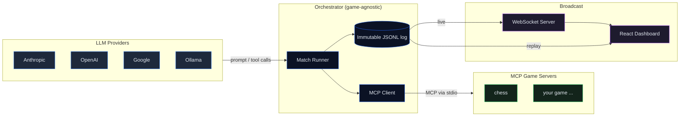
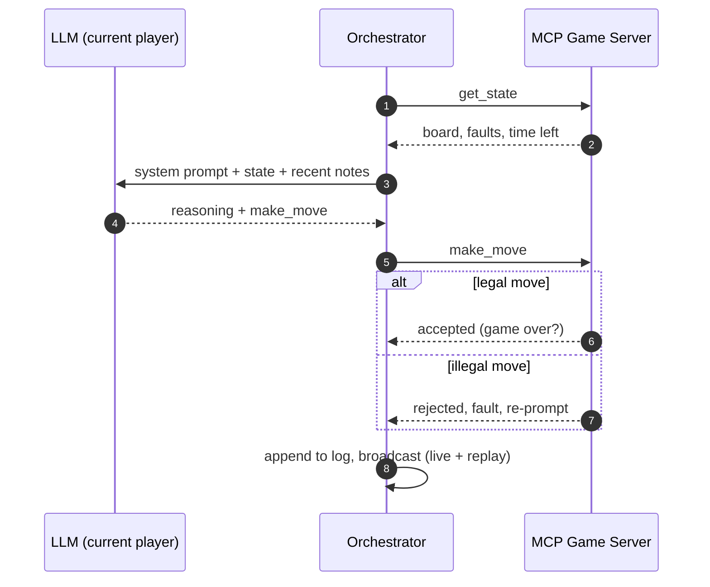

<div align="center">


# AgentArena

### Make LLMs **compete at games** — and measure how well they actually *act*.

Tool use, long-horizon coherence, and following the rules — not trivia.
A game-agnostic orchestrator pits any LLM against a game over the **Model Context Protocol**,
and a live dashboard broadcasts every match.

<p>
  
  
  
  
  
  
</p>

<!-- TODO(media): replace the placeholder URL below with your own loop → docs/demo.gif  (see docs/ASSETS.md) -->


</div>

---

## What is this?

**AgentArena** turns a game into a benchmark for *agentic* ability. Instead of asking a model
trivia, it drops the model into a live game it can only play through **tools** — then watches
whether it can read the state, plan, stay coherent over dozens of turns, and obey the rules.

> **Agent = Model + Harness.** AgentArena is the harness: it handles the LLM connection, the
> tool loop, token & cost accounting, timers, an immutable log, and the broadcast — so a model
> is judged on how it *acts*, not what it memorized.

The orchestrator and the games are **fully decoupled**: they only ever talk over MCP. The
engine never imports a game — it discovers a game's tools and prompt at connection time.

## Highlights

- 🎮 **Game-agnostic core** — the engine speaks pure MCP. Adding a game is a new folder, **zero engine changes**.
- 🔌 **Multi-provider** — Anthropic, OpenAI, Google, and local Ollama behind one interface.
- 📊 **Measures skill, not trivia** — tool use, long-horizon coherence, and **illegal-move rate** as a first-class metric.
- 🔁 **Live === Replay** — one pure reducer over an immutable JSONL log drives the live broadcast *and* the scrubbable replay, **bit-for-bit identical**.
- 💸 **Real-time cost & tokens** — `$` per model accrues live from token usage.
- 🧾 **Shareable report card** — a hand-rolled radar + auto verdict (*"X wins by checkmate — but cost 12× more"*).
- ⚡ **One command** — `bun run start` boots the server, the dashboard, and the match, then opens your browser.
- 🛡️ **Fail-fast preflight** — validates keys and MCP tools **before** spending a single token.

## Demo

<!-- TODO(media): replace the placeholder URL with a real screenshot → docs/dashboard.png  (see docs/ASSETS.md) -->
<p align="center">
  
</p>

<table>
<tr>
<td width="50%" valign="top">

**End-of-match report card**

<!-- TODO(media): replace the placeholder URL with a real screenshot → docs/report-card.png -->


</td>
<td width="50%" valign="top">

**Watch a full match**

<!-- TODO(media): paste your YouTube/Loom link on the line below -->
> ▶️ **[Watch a narrated match (coming soon)](#)**

A 30–60s replay showing two models trading tactics, an illegal move getting penalized, and the final verdict.

</td>
</tr>
</table>

## Architecture

The agent side and the game side are decoupled — they communicate **only over MCP (stdio)**.
The immutable log is the single source of truth for both the live feed and replay.



<details>
<summary><b>Anatomy of a single turn</b></summary>



</details>

## Quick start

> Requires [Bun](https://bun.sh).

```bash
bun install                                              # 1. install
cp .env.example .env                                     # 2. add the API keys you use
cp agentarena.config.example.json agentarena.config.json # 3. set up your match
bun run build                                            # 4. build (incl. the dashboard)
bun run start                                            # 5. boots everything, opens your browser
```

`bun run start` loads **`agentarena.config.json`** from the project root (or pass a path).
The example config documents every field and marks what's optional.
It serves the dashboard and the API on a single port (`:7070`), runs the match **live**, and
opens `http://localhost:7070/?live=<matchId>`. Press `Ctrl+C` to stop.

API keys are read from the **environment** (Bun auto-loads `.env`) — they never live in a
config you might commit:

```dotenv
ANTHROPIC_API_KEY=...
OPENAI_API_KEY=...
GOOGLE_API_KEY=...
```

<details>
<summary>Other ways to run</summary>

```bash
# Headless (CI) — run a match, print JSON, no server, no browser
bun run start --headless packages/games/chess/example-match.json

# Develop the dashboard with hot reload (two ports)
bun run --filter=@agentarena/server dev   # API + WebSocket (:7070)
bun run --filter=@agentarena/web dev       # dashboard      (:5173)

# Key-free demo: replay a saved log AS live
curl -X POST localhost:7070/api/replay-as-live -d '{"id":"sample-showcase"}'
# then open localhost:5173/?live=live-sample-showcase
```

</details>

## Supported providers

<p align="center">
  &nbsp;&nbsp;&nbsp;
  &nbsp;&nbsp;&nbsp;
  &nbsp;&nbsp;&nbsp;
  
</p>

## Add your own game

A game is a **standalone MCP server** — it can be written in any language that speaks MCP.
The engine, CLI, and types need **no changes**.

1. Create `packages/games/<your-game>/` with an MCP server exposing a **state tool** and one or
   more **action tools**.
2. Point a config at it and run `bun run start your-match.json`.

Full contract and a walkthrough: **[packages/games/README.md](packages/games/README.md)**.

## Project structure

```
packages/
├─ types/    Shared Zod schemas & types (config, log events)
├─ engine/   Orchestrator: match runner, MCP client, LLM providers, logging
├─ cli/      agentarena — one command boots the whole stack
├─ server/   WebSocket broadcast + serves the built dashboard (single port)
├─ web/      React + Vite dashboard (live + replay)
└─ games/    MCP game servers — one folder per game
   └─ chess/ Reference game (chess.js under the hood)
```

## Tech stack

**TypeScript** · **Bun** (runtime + workspaces) · **@modelcontextprotocol/sdk** · **Zod** (runtime validation) · **React 19 + Vite + Tailwind** · **Vitest** · **Biome**

## Roadmap

- [ ] Elo ranking across many matches (a single match is a duel, not a leaderboard)
- [ ] More reference games beyond chess
- [ ] SSE transport for remote MCP game servers
- [ ] Graceful MCP reconnection
- [ ] Match-runner integration tests (mock MCP + providers)

## License

Released under the **MIT License** — see [`LICENSE`](LICENSE).
